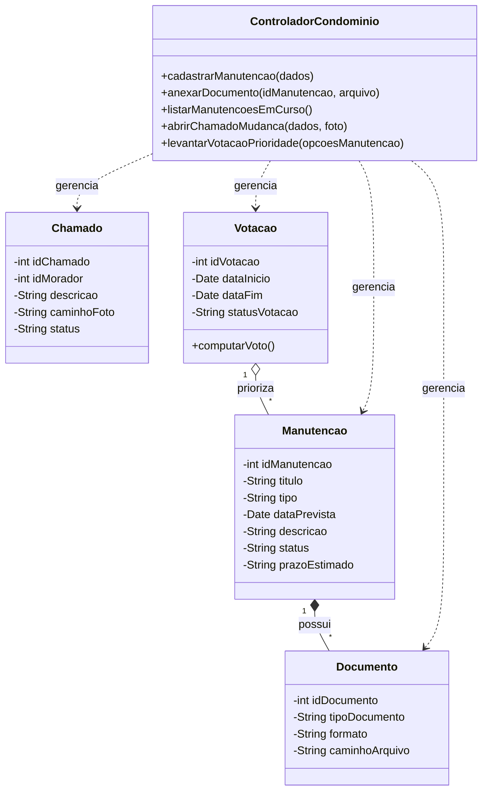

```mermaid
classDiagram

    %% --- Entidades (Modelo) ---
    class Manutencao {
        -int idManutencao
        -String titulo
        -String tipo
        -Date dataPrevista
        -String descricao
        -String status
        -String prazoEstimado
    }

    class Documento {
        -int idDocumento
        -String tipoDocumento
        -String formato
        -String caminhoArquivo
    }

    class Chamado {
        -int idChamado
        -int idMorador
        -String descricao
        -String caminhoFoto
        -String status
    }

    class Votacao {
        -int idVotacao
        -Date dataInicio
        -Date dataFim
        -String statusVotacao
        +computarVoto()
    }

    %% --- Controlador Único (Serviço/Fachada) ---
    class ControladorCondominio {
        +cadastrarManutencao(dados)
        +anexarDocumento(idManutencao, arquivo)
        +listarManutencoesEmCurso()
        +abrirChamadoMudanca(dados, foto)
        +levantarVotacaoPrioridade(opcoesManutencao)
    }

    %% --- Relacionamentos ---
    Manutencao "1" *-- "*" Documento : possui
    Votacao "1" o-- "*" Manutencao : prioriza

    ControladorCondominio ..> Manutencao : gerencia
    ControladorCondominio ..> Chamado : gerencia
    ControladorCondominio ..> Votacao : gerencia
    ControladorCondominio ..> Documento : gerencia
```